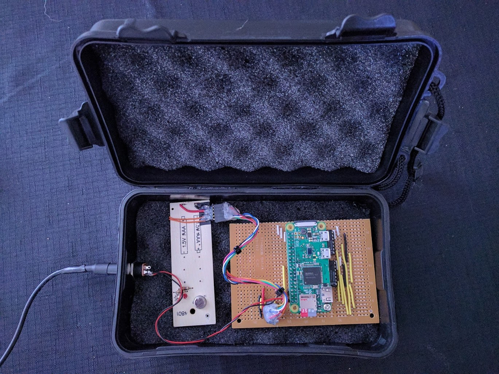
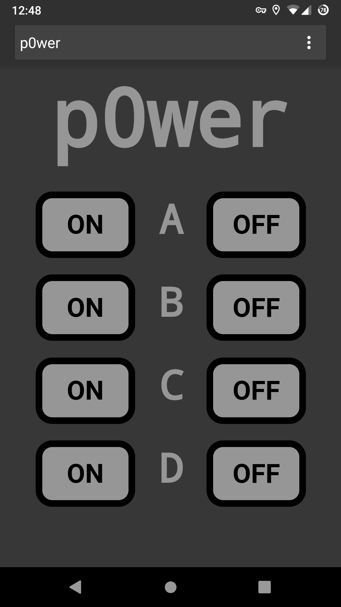

# p0wer
Remotely control power outlets via a raspberrypi zero W interfaced with a modified off-the-shelf wireless 4-channel mains remote control.  Check the KiCad directory for the [schematic](KiCad_p0wer/p0wer_schematic.pdf).  More info can be found here: [clews.pro/projects/p0wer.html](https://clews.pro/projects/p0wer.html)

## Installation:
On the raspberry pi install the pigpio library:
```bash
$ sudo apt update
$ sudo apt install pigpio
```

Clone this repository and enter the cloned project directory:
```bash
$ git clone https://gitlab.com/clewsy/p0wer
$ cd p0wer
```
Compile the executable:
```bash
$ make all
```
The binary is now ready to use.  For frequent calls it can be copied to the /usr/local/sbin directory:
```bash
$ sudo cp p0wer /usr/local/sbin/p0wer
```

## Usage:
The command can be called directly or from within a shell script (example script: [p0wer_switch.sh](https://gitlab.com/clewsy/scripts/blob/master/p0wer_switch.sh)).
Note, super user access is required to manipulate the gpio.
```bash
$ sudo p0wer <channel(a,b,c,d)> <on/off>
```

## Usage (with php):
Using php provides a simple way to execute p0wer via a web browser.  An example php snippet follows that would effectively run the "p0wer a on" command:
```php
<?php
	exec("bin/p0wer a on");
?>
```
Note, executing p0wer this way from a browser likely means the host user is www-data.  As such, privileges may typically prevent this from being effective.  There are methods around this including setting the SUID bit as in the WebUI setup instructions below.  Do so only if you understand the implications.

## Photo:
Here is my hacked together rf remote and Raspberry Pi Zero W.




# WebUI:

If you'd like a simple web interface to run the executable you can use the html/php/css found in the [webui](https://gitlab.com/clewsy/p0wer/tree/master/webui) directory.  Here is a screenshot of the webui on an android smartphone:



## p0wer WebUI Installation:
First follow the instructions above to compile and install the executable.

To run the webui, the raspberry pi will require installation of php and also web server software such as [Apache](https://httpd.apache.org/), [NGinX](https://nginx.org/), [Lighttpd](https://www.lighttpd.net/) or similar.  The following instructions will use Apache.

```shell
$ sudo apt update
$ sudo apt install apache php
```
By default, Apache will serve html/css/php files stored at /var/www/html.

From within this directory, delete any existing files then copy the webui files from the previously cloned repository:

```shell
$ cd /var/www/html
$ sudo rm -r *
$ sudo cp --recursive ~/p0wer/webui/* .
```

The php script expects the p0wer executable to be located at /var/www/html/bin/super_p0wer.  You will need to create this renamed copy of the p0wer executable and set the SUID bit.  Doing so will mean that when the webui user (typically www-data) calls the executable, it will actually be run as the file owner (root).  This allows the browser to run the file without being a superuser.

```shell
$ sudo cp ~/p0wer/p0wer /var/www/html/bin/super_p0wer
$ sudo chmod +s /var/www/html/bin/super_p0wer
```

Your web interface should now be available over your local network.  If the hostname of your raspberry pi remains as the default, then the p0wer WebUI should be accessible from your browser at http://raspberrypi/
